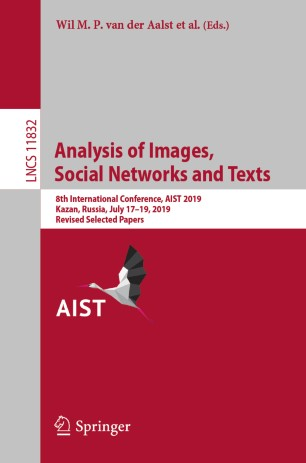

<figure></figure> <figure></figure>

<table style="width: 97%">
    <tbody>
        <tr>
            <td style="width: 40%;"></td>
            <td style="width: 30%;">Year</td>
            <td>Proceedings</td>
        </tr>
        <tr>
            <td style="width: 40%;"> <figure></figure> <figure></figure></td>
            <td style="width: 30%;">2019</td>
            <td><a href="https://link.springer.com/book/10.1007/978-3-030-37334-4">LNCS</a>, <a href="https://link.springer.com/book/10.1007/978-3-030-39575-9">CCIS</a></td>
        </tr>
        <tr>
            <td style="width: 40%;"></td>
            <td style="width: 30%;">2018</td>
            <td><a href="https://link.springer.com/book/10.1007/978-3-030-11027-7">LNCS</a></td>
        </tr>
        <tr>
            <td style="width: 40%;"></td>
            <td style="width: 30%;">2017</td>
            <td><a href="https://link.springer.com/book/10.1007/978-3-319-73013-4">LNCS</a></td>
        </tr>
        <tr>
            <td></td>
            <td>2016</td>
            <td><a href="https://link.springer.com/book/10.1007/978-3-319-52920-2">CCIS</a></td>
        </tr>
        <tr>
          <td></td>
          <td>2015</td>
          <td><a href="https://link.springer.com/book/10.1007/978-3-319-26123-2">CCIS</a></td>
        </tr>
        <tr>
            <td></td>
            <td>2014</td>
            <td><a href="https://link.springer.com/book/10.1007/978-3-319-12580-0">CCIS</a></td>
        </tr>         
</tbody>
</table>

